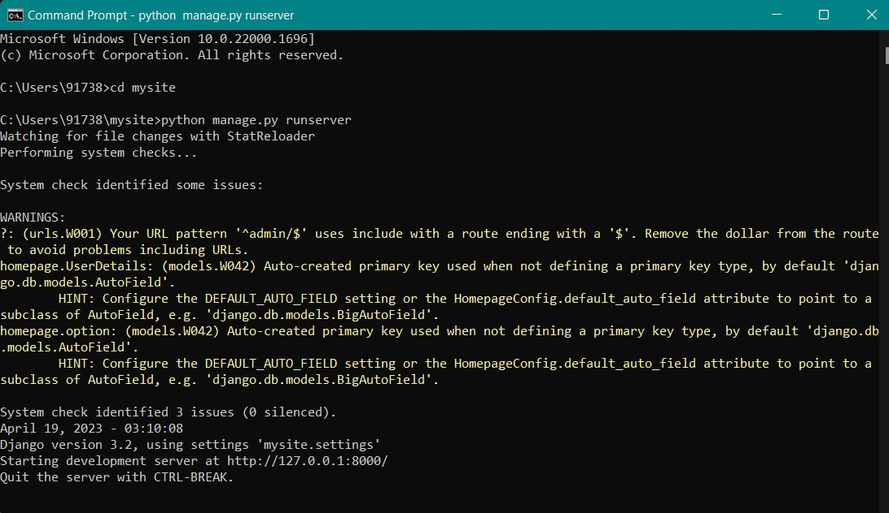
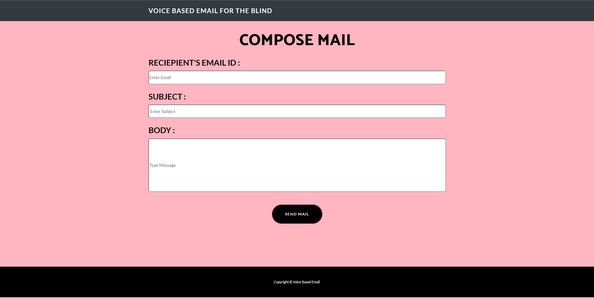
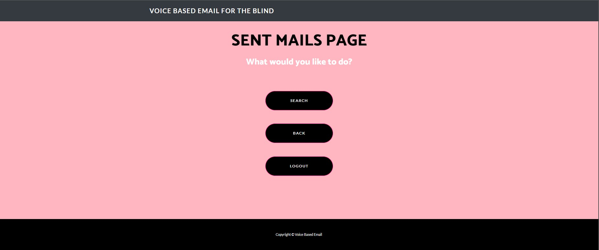
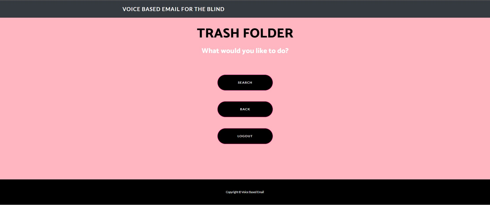

# IR-Project-Group-24
IR-Project-Group-24 : An Voice Based Email System For The Blind Persons
 

## An Introduction To Our Project
 

 1. VOICE RECOGNITION SYSTEM:  
The voice-based email system uses a speech recognition algorithm to analyze the input from the user's voice. The system then generates a written transcript of the user's message, based on the most likely interpretation of the audio input. 

 2. USER INPUT:
The user will be required to provide  their login information and confirm  their entry.  

 3 . INPUT VALIDATION: 
The user is then directed to the  main menu, where he or she can select one of the options for the  email operation to be carried out. 

 4. SPEEECH –TO –TEXT TRANSCRIPTION:
After the user dictates their  message, the system uses a  speech-to-text transcription  technology to turn it into text. 

 5. TEXT-TO-SPEECH OUTPUT:  The system reads out the  contents of the user’s messages to them using a text-to-speech tool when they  are listening to their messages. 

 

## How To Run Project
 

 <b> Step 1 : Install The Following Dependencies Using Command Prompt </b> 

 <li> pip install Django==3.2.10 </li> 
 

 <li> pip install pyaudio==0.2.13 </li> 

 <li> pip install SpeechRecognition==3.9.0 </li> 

 <li> pip install gTTS==2.3.1 </li> 

 <li> pip install playsound==1.2.2 </li> 

 <b> Step 2 : Open Command Prompt And Set The Location Where Group-24 Folder is Downloaded </b> 

 <b> Step 3 : Run The Command python manage.py runserver And Open The Link http://127.0.0.1:8000/ in your browser </b> 

 

## Screenshot Of CMD : 

## 
 <b> NOTE : After The Browser Opens, Single Click Anywhere On the Screen To Start Interacting With Our System </b> 

 

## Screenshots :

 

 

 

 

 

 
